# Astervoids Architecture

## System Overview

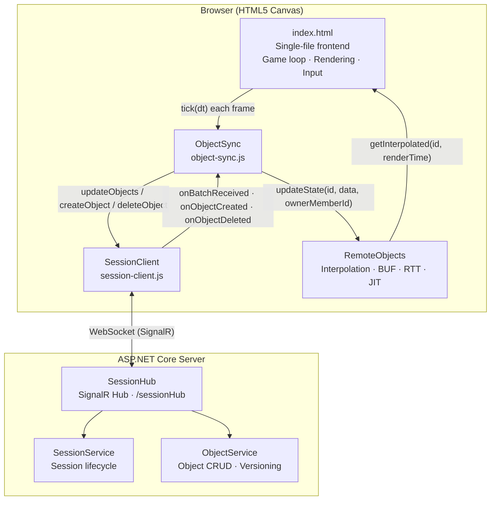

---

## Backend Data Model

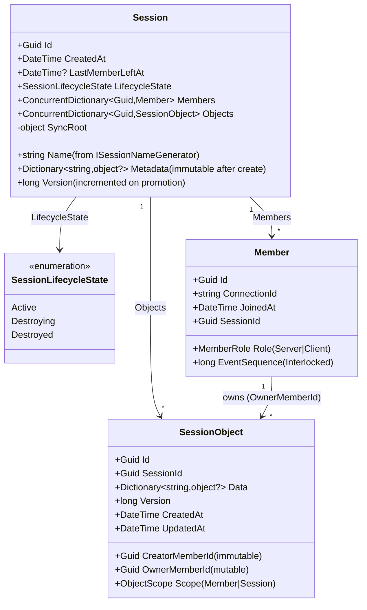

## Service Layer

```mermaid
graph TB
    subgraph "SessionService"
        direction TB
        SS_DICT["State:<br/>_sessions: ConcurrentDictionary&lt;Guid, Session&gt;<br/>_connectionToMember: ConcurrentDictionary&lt;string, Guid&gt;<br/>_memberToSession: ConcurrentDictionary&lt;Guid, Guid&gt;"]
        SS_CFG["Config:<br/>MaxSessions: 6<br/>MaxMembersPerSession: 4<br/>Names from ISessionNameGenerator<br/>(default: FruitNameGenerator, 50 names)"]
        SS_DEP["Member departure (atomic in LeaveSession):<br/>• Remove from indexes<br/>• Promote oldest remaining if Server left<br/>• HandleObjectDeparture: delete Member-scoped,<br/>  migrate Session-scoped (round-robin)<br/>• Mark LastMemberLeftAt for deferred cleanup"]
    end

    subgraph "ObjectService"
        direction TB
        OS_OPS["Operations (all enforce ownership + lifecycle<br/>under session.SyncRoot):<br/>CreateObject → Id, Version=1, Owner<br/>UpdateObject → merge, Version++ (no ownership check)<br/>UpdateObjects → Batch, owner-filtered atomically<br/>DeleteObject → ownership-checked TryRemove<br/>ReplaceObject → atomic delete + create children"]
    end

    subgraph "FruitNameGenerator (ISessionNameGenerator)"
        direction TB
        FNG["50-fruit pool (Apple, Banana, ...)<br/>Pick random unused name<br/>If all used → append counter (Apple2)"]
    end

    subgraph "ServerMetricsService (singleton)"
        direction TB
        SMS["Tracks: CPU/memory/GC/thread pool,<br/>connection counts, hub invocations,<br/>per-member TX/RX bytes, reconciliations,<br/>reconnects.<br/>Exposed via GET /api/srvmon (camelCase JSON)."]
    end

    subgraph "SessionCleanupService (BackgroundService)"
        direction TB
        SCS_OPS["Runs every 10 seconds<br/>Empty timeout: destroy sessions with no members<br/>Absolute timeout: destroy sessions exceeding max lifetime<br/>Notifies connected members via SignalR OnSessionExpired<br/>Broadcasts OnSessionsChanged on any cleanup"]
        SCS_CFG["Config (SessionSettings):<br/>EmptyTimeoutSeconds: 30<br/>AbsoluteTimeoutMinutes: 20<br/>ClientTimeoutSeconds: 20<br/>KeepAliveSeconds: 10"]
    end
```

## SessionService: Lookup Chain

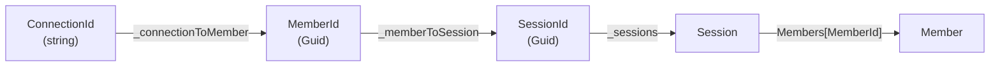

## SessionService: Create & Join

```mermaid
flowchart TB
    subgraph "CreateSession(metadata?)"
        CS1{"Connection already<br/>in a session?"}
        CS2{"Active sessions<br/>>= maxSessions (6)?"}
        CS4["Pick session name via ISessionNameGenerator<br/>(default FruitNameGenerator: random unused fruit;<br/>append counter if pool exhausted)"]
        CS5["Create Session with Name + Metadata"]
        CS6["Create Member with Role=Server"]
        CS7["Add to _sessions, _connectionToMember,<br/>_memberToSession, session.Members"]
        CS8["Return CreateSessionResult<br/>{Success, Session, Creator}"]
        CSE["Return error"]

        CS1 -->|Yes| CSE
        CS1 -->|No| CS2
        CS2 -->|Yes| CSE
        CS2 -->|No| CS4 --> CS5 --> CS6 --> CS7 --> CS8
    end

    subgraph "JoinSession(sessionId, evictMemberId?)"
        JS1{"Connection already<br/>in a session?"}
        JS2{"Session exists<br/>AND Active?"}
        JSE_EVICT{"evictMemberId given<br/>AND stale member found<br/>(different connection)?"}
        EVI["EvictMemberInternal:<br/>remove from indexes, promote if was Server,<br/>HandleObjectDeparture (delete + migrate)"]
        JS3{"Members.Count<br/>>= maxMembers (4)?"}
        WAS{"Session was empty<br/>(rejoining)?"}
        JS4S["Create Member with Role=Server"]
        JS4C["Create Member with Role=Client"]
        ADOPT["AdoptOrphanedObjects:<br/>reassign session-scoped objects<br/>without a current owner"]
        JS5["Clear session.LastMemberLeftAt"]
        JS6["Return JoinSessionResult<br/>{Success, Session, Member, Eviction?}"]
        JSE["Return error"]

        JS1 -->|Yes| JSE
        JS1 -->|No| JS2
        JS2 -->|No| JSE
        JS2 -->|Yes| JSE_EVICT
        JSE_EVICT -->|Yes| EVI --> JS3
        JSE_EVICT -->|No| JS3
        JS3 -->|Yes| JSE
        JS3 -->|No| WAS
        WAS -->|Yes| JS4S --> ADOPT --> JS5
        WAS -->|No| JS4C --> JS5
        JS5 --> JS6
    end
```

## SessionService: Leave & Server Promotion

`LeaveSession` is **atomic** under `session.SyncRoot` — membership change, server
promotion, and object cleanup happen in one critical section and a single
`LeaveSessionResult` is returned to the hub. There is no separate
`HandleMemberDeparture` call (that responsibility moved out of `ObjectService`).

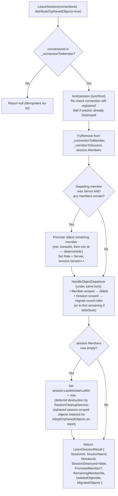

## ObjectService: Update Flow

All mutations run under `Session.SyncRoot`. Ownership and session lifecycle are
validated atomically inside `ObjectService` itself (the hub still pre-checks for
fast early-return / logging, but correctness does not rely on it).

```mermaid
flowchart TB
    subgraph "UpdateObject (single, no ownership check)"
        U1["UpdateObject(sessionId, objectId, data)"]
        U2{"Session active?<br/>Object exists?"}
        U4["Replace obj.Data with merged copy<br/>obj.Version++<br/>obj.UpdatedAt = now"]
        U5["Return updated SessionObject"]
        UF["Return null (failure)"]

        U1 --> U2
        U2 -->|No| UF
        U2 -->|Yes| U4 --> U5
    end

    subgraph "UpdateObjects (batch, ownership enforced in service)"
        B1["UpdateObjects(sessionId, ownerMemberId, updates)"]
        B2{"For each update:<br/>object exists AND<br/>OwnerMemberId == ownerMemberId?"}
        B3["Merge data, Version++,<br/>UpdatedAt = now"]
        B4["Skip (continue)"]
        B5["Return ONLY successfully<br/>updated objects"]

        B1 --> B2
        B2 -->|Yes| B3 --> B5
        B2 -->|No| B4 --> B5
    end

    subgraph "DeleteObject (ownership enforced in service)"
        D1["DeleteObject(sessionId, objectId, ownerMemberId)"]
        D2{"Object exists AND<br/>owned by ownerMemberId?"}
        D3["TryRemove from session.Objects<br/>Return deleted SessionObject"]
        D4["Return null (no-op)"]

        D1 --> D2
        D2 -->|Yes| D3
        D2 -->|No| D4
    end

    subgraph "ReplaceObject (atomic delete + create)"
        R1["ReplaceObject(sessionId, deleteObjectId,<br/>ownerMemberId, replacements[])"]
        R2{"Session active AND<br/>delete target owned<br/>by ownerMemberId?"}
        R3["Delete target,<br/>create each replacement<br/>(Version=1, owner = caller or override)"]
        R4["Return created list"]
        R5["Return null (no changes applied)"]

        R1 --> R2
        R2 -->|Yes| R3 --> R4
        R2 -->|No| R5
    end
```

## SessionService: Member Departure & Ownership Redistribution

`HandleObjectDeparture` is a private helper of `SessionService`, called inside
`LeaveSession` and `EvictMemberInternal` while `session.SyncRoot` is held. The
results (`DeletedObjectIds`, `MigratedObjects`) are bundled into
`LeaveSessionResult` / `EvictionInfo` so the hub can broadcast a single
`OnMemberLeft` event.

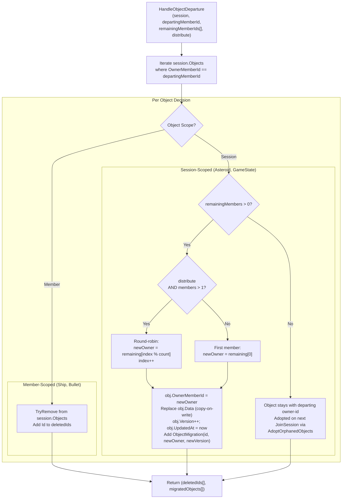

### Round-Robin Example (3 players, Player B leaves)

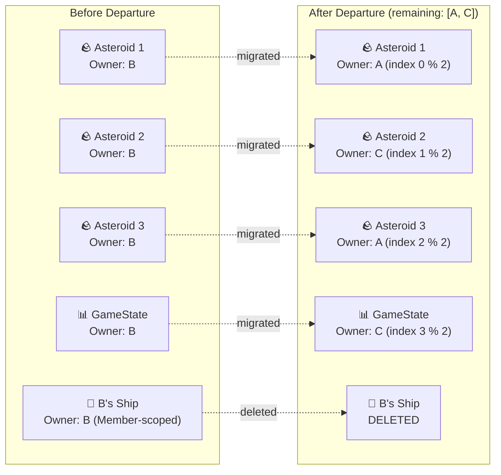

## SessionHub: Method Signatures & Broadcast Patterns

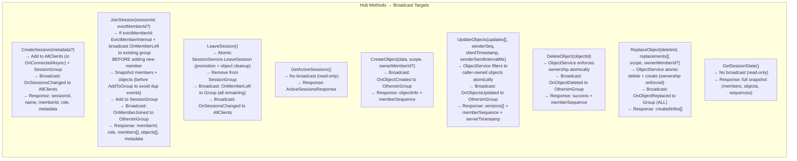

## SessionHub: UpdateObjects Detail

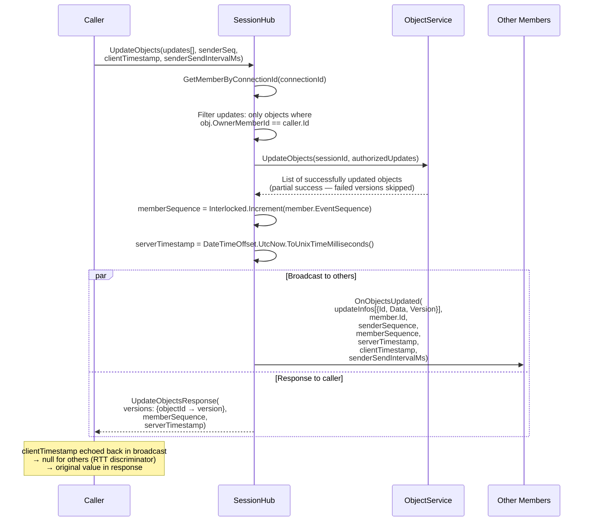

## SessionHub: Leave & Disconnect Flow

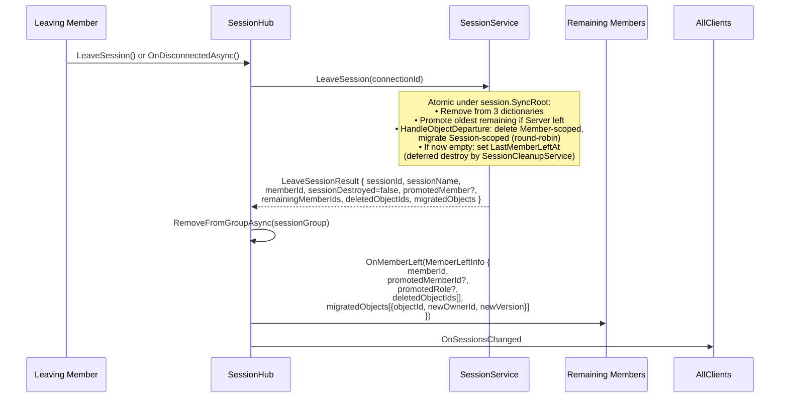

## SignalR Group Management

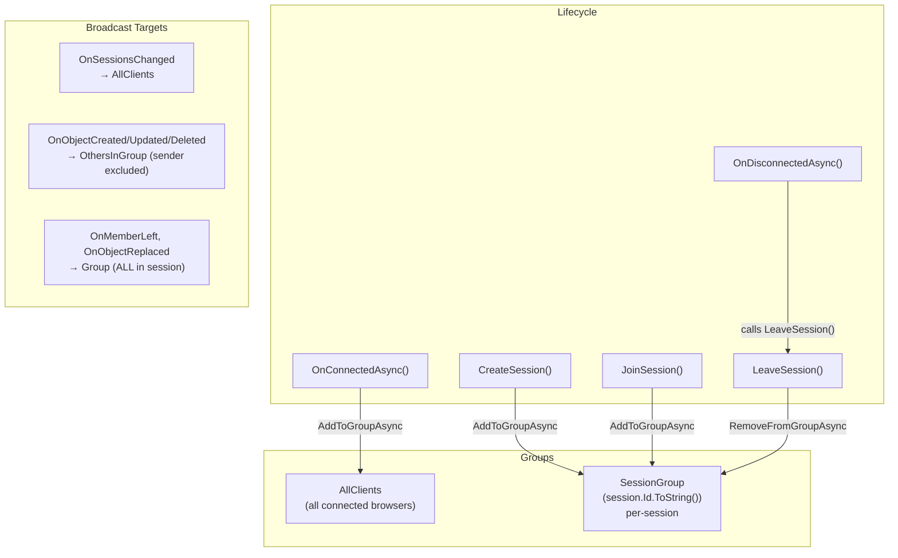

## SessionHub: ReplaceObject (Atomic Delete + Create)

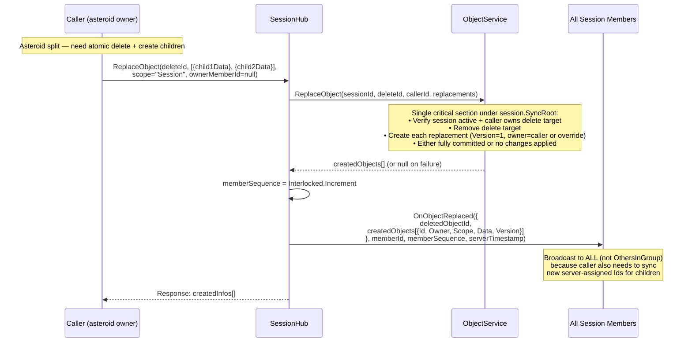

## Session & Member Model

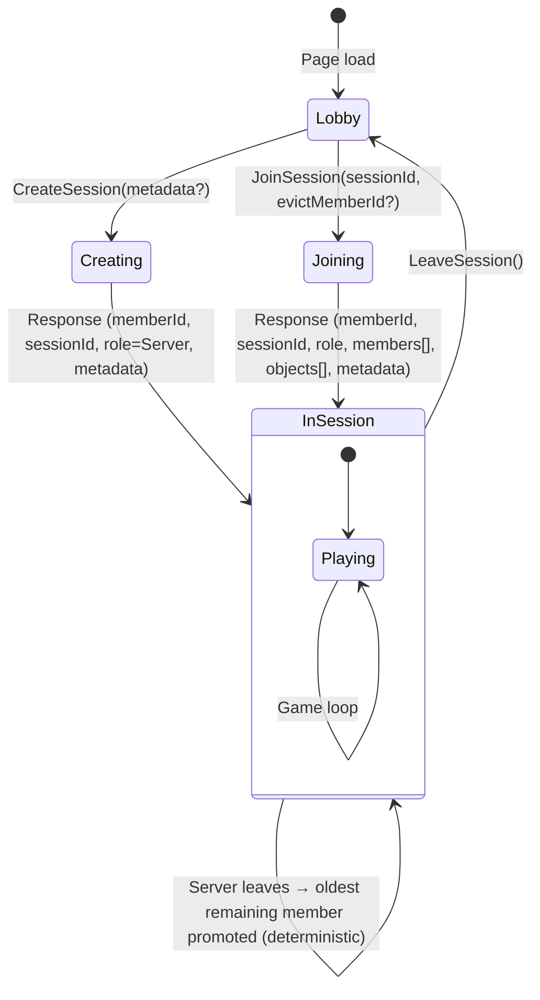

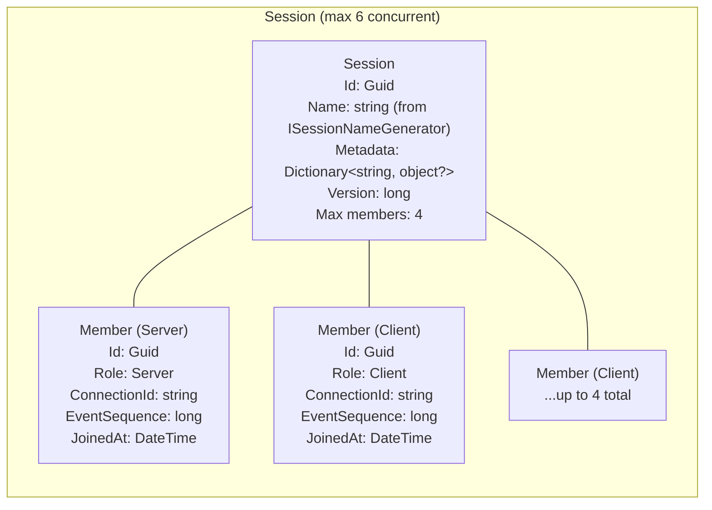

## Object Model & Ownership

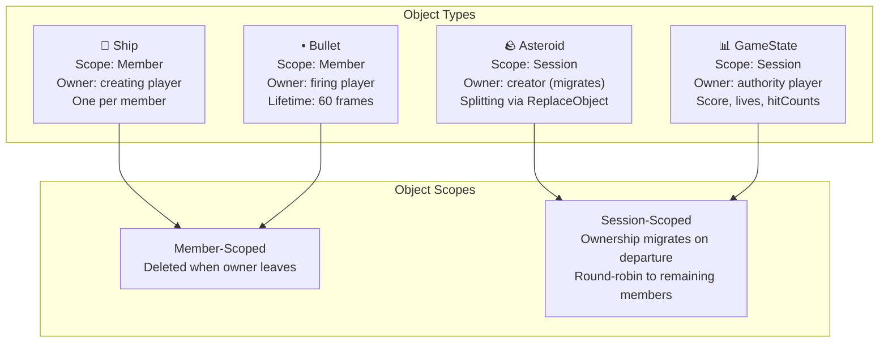

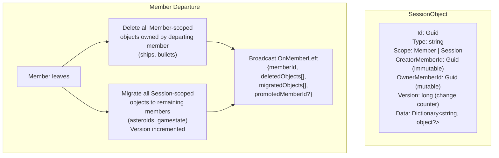

## Async Send/Receive & Sequencing

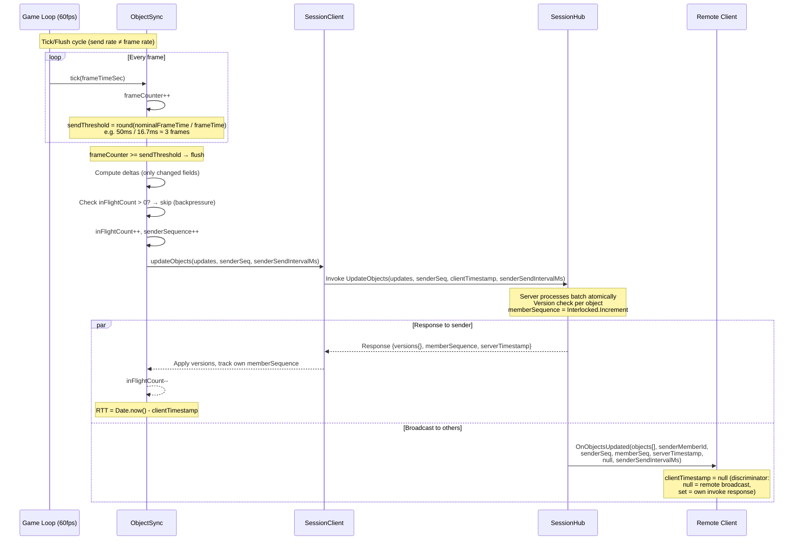

## Sequence Gap Detection & Reconciliation

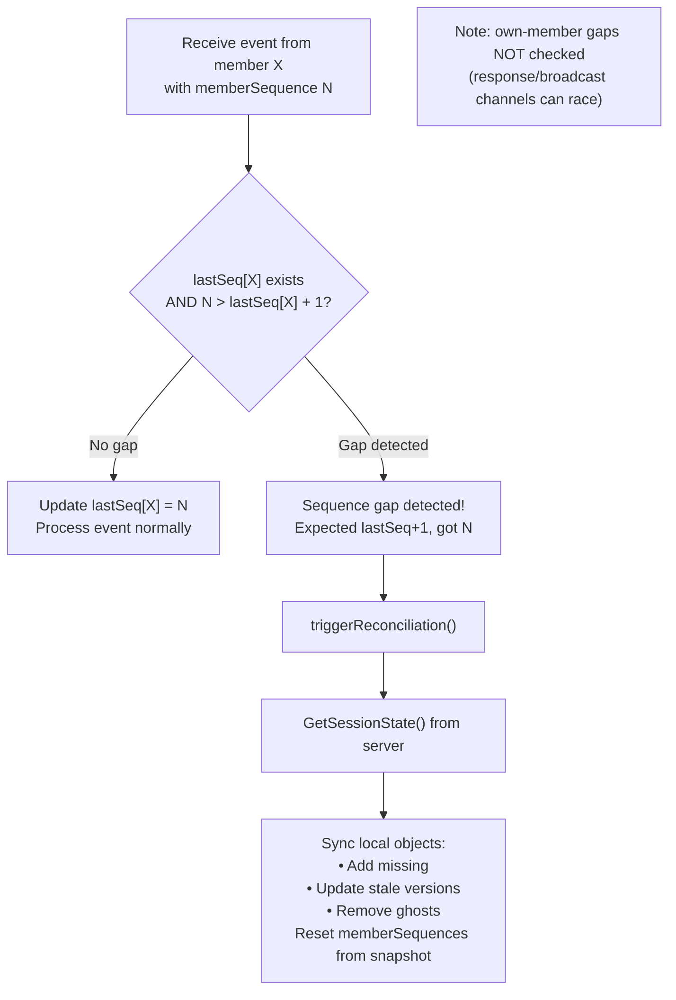

## Networking: RTT → TX → BUF Pipeline

```mermaid
flowchart LR
    subgraph "RTT Estimation"
        SAMPLE["RTT sample =<br/>Date.now() - clientTimestamp"]
        EMA["Asymmetric EMA:<br/>spike: α=0.3 (fast up)<br/>decay: α=0.1 (slow down)<br/>rtt += α × (sample - rtt)"]
        SAMPLE --> EMA
    end

    subgraph "TX (Send Rate)"
        FORMULA["nominalFrameTime =<br/>clamp(rtt/1000,<br/>1/20, 1/1)"]
        TABLE["RTT 4ms → TX 50ms (20Hz)<br/>RTT 100ms → TX 100ms (10Hz)<br/>RTT 500ms → TX 500ms (2Hz)<br/>RTT 1500ms → TX 1000ms (1Hz)"]
        FORMULA --- TABLE
    end

    subgraph "Backpressure"
        BP["flushInProgress?<br/>→ cap frame counter at threshold<br/>→ flush on next tick after completion<br/>(instant congestion signal)"]
    end

    EMA --> FORMULA
    EMA --> BP
```

```mermaid
flowchart TB
    subgraph "Per-Member BUF Calculation"
        direction TB
        PKT["Packet arrives from member X<br/>(remote broadcast only: clientTimestamp=null)"]
        MEM["getMemberDelay(senderMemberId)<br/>Independent state per member"]
        INT["interval = serverTimestamp - lastServerTimestamp"]
        OUT{"interval > 2 × remoteSendInterval?"}
        SKIP["Outlier: skip interval<br/>(idle gap / delta suppression)"]
        REC["Record interval in packetIntervals[]<br/>(sliding window, 30 samples)"]

        PKT --> MEM
        MEM --> INT
        INT --> OUT
        OUT -->|Yes| SKIP
        OUT -->|No| REC
    end

    subgraph "BUF Formula"
        direction TB
        CALC["observedMean = mean(packetIntervals)<br/>σ = stddev(packetIntervals)<br/>mean = remoteSendInterval ∥ observedMean<br/><br/>networkFactor = min(1.0,<br/>  0.25 + RTT / (2 × mean))<br/><br/>rawDelay = max(16.67ms,<br/>  mean × networkFactor + 2σ)<br/><br/>computedDelay += 0.1 × (rawDelay - computedDelay)"]
    end

    subgraph "Example (localhost)"
        EX["RTT=4ms, TX=50ms, σ=1.7ms<br/>nf = 0.25 + 4/(2×50) = 0.29<br/>raw = 50×0.29 + 2×1.7 = 17.9ms<br/>BUF converges to ~18ms"]
    end

    REC --> CALC
    CALC --> EX
```

## Ring Buffer Interpolation

```mermaid
flowchart TB
    subgraph "Per-Object Ring Buffer (max 6 snapshots)"
        S1["snapshot[0]<br/>data, time, velocity, rotationSpeed"]
        S2["snapshot[1]"]
        S3["snapshot[2]"]
        S4["snapshot[3]"]
        S5["..."]
        S6["snapshot[5]<br/>(newest)"]
        S1 --- S2 --- S3 --- S4 --- S5 --- S6
    end

    TARGET["targetTime = renderTime - getDelayForMember(ownerMemberId)"]

    subgraph "Bracket Search (reverse scan)"
        direction TB
        BEFORE{"targetTime ≤ oldest?"}
        CLAMP["Return oldest snapshot (clamped)"]
        BRACKET{"Find i where<br/>snap[i].time ≤ targetTime < snap[i+1].time"}
        HERMITE["Build pseudo-state from snap[i] & snap[i+1]<br/>Hermite interpolate with t ∈ (0,1]"]
        AFTER{"targetTime ≥ newest?"}
        EXTRAP["Extrapolate with velocity<br/>capped at MAX_EXTRAPOLATION (1.0s)"]
    end

    TARGET --> BEFORE
    BEFORE -->|Yes| CLAMP
    BEFORE -->|No| AFTER
    AFTER -->|Yes| EXTRAP
    AFTER -->|No| BRACKET
    BRACKET --> HERMITE
```

```mermaid
flowchart LR
    subgraph "Hermite Interpolation"
        BASIS["Basis functions:<br/>h00 = 2t³ - 3t² + 1<br/>h10 = t³ - 2t² + t<br/>h01 = -2t³ + 3t²<br/>h11 = t³ - t²"]
        POS["Position (x,y):<br/>p = h00·p₀ + h10·m₀ + h01·p₁ + h11·m₁<br/><br/>Tangents m = velocity × velScale × dt<br/>velScale = refDim / gameWidth<br/>Wrap-aware Δ for p₁ - p₀"]
        ANG["Angle:<br/>Same Hermite with rotationSpeed tangents<br/>rpsToPerSec = TARGET_FPS (60)<br/>Shortest-arc via ±π wrapping"]
        SNAP{"‖p₁ - p₀‖ > SNAP_THRESHOLD (0.25)?"}
        SNAPR["Skip interpolation → snap to p₁"]

        BASIS --> POS
        BASIS --> ANG
        POS --> SNAP
        SNAP -->|Yes| SNAPR
    end
```

## Cross-Owner Collision

```mermaid
sequenceDiagram
    participant A as Player A (bullet owner)
    participant SRV as Server
    participant B as Player B (asteroid owner)

    Note over A: A's bullet hits B's asteroid locally
    A->>A: Mark bullet pendingHit=true, hitTargetId=asteroidId
    A->>SRV: UpdateObjects(bullet with pendingHit)
    SRV->>B: OnObjectsUpdated (bullet data with pendingHit)

    Note over B: B scans remote bullets for pendingHit on own asteroids
    B->>B: Process split: create child asteroids
    B->>SRV: ReplaceObject(asteroidId, [child1, child2])
    SRV->>A: OnObjectReplaced (broadcast to ALL)
    SRV->>B: OnObjectReplaced (broadcast to ALL)

    Note over A: A sees asteroid replaced → confirms hit, awards points
```

## Response-First vs Local-First Patterns

```mermaid
flowchart TB
    subgraph "CreateObject (Response-First)"
        direction TB
        C1["Caller invokes CreateObject"]
        C2["Wait for server response<br/>(server assigns Id, Version=1)"]
        C3["Register object in local Map<br/>from response"]
        C4["Broadcast: OthersInGroup<br/>(sender excluded)"]
        C5["If isStillNeeded callback returns false:<br/>auto-delete server object"]
        C1 --> C2 --> C3
        C2 --> C4
        C3 --> C5
    end

    subgraph "DeleteObject (Local-First)"
        direction TB
        D1["Remove from local Map immediately<br/>(before server call)"]
        D2["Remove from pendingUpdates"]
        D3["Invoke server DeleteObject"]
        D4["Server verifies ownership<br/>(rejects if not owner)"]
        D5["Broadcast: OthersInGroup<br/>(sender excluded)"]
        D1 --> D2 --> D3 --> D4 --> D5
    end

    subgraph "ReplaceObject (Broadcast-Dependent)"
        direction TB
        R1["Invoke server ReplaceObject"]
        R2["Server creates children,<br/>deletes parent"]
        R3["Broadcast: Group (ALL)<br/>sender included"]
        R4["Sender updates local Map<br/>from broadcast echo"]
        R1 --> R2 --> R3 --> R4
    end
```

## Delta Encoding & Deferred Confirmation

```mermaid
sequenceDiagram
    participant OS as ObjectSync
    participant SC as SessionClient
    participant SRV as Server

    Note over OS: computeDelta(): compare current data vs lastSentData<br/>Uses shallow reference comparison (===)<br/>Nested objects must be spread into new refs

    OS->>OS: delta = computeDelta(objectId, data)<br/>lastSentData NOT updated yet

    OS->>SC: updateObjects(deltas, senderSeq, sendIntervalMs)
    SC->>SRV: Invoke UpdateObjects(deltas, ...)

    alt Server accepts batch
        SRV-->>SC: Response {versions: {id→ver}, ...}
        SC-->>OS: confirmSentDeltas(sentDeltas, versions)
        OS->>OS: Update lastSentData only for<br/>confirmed objects
    else Network error / null response
        Note over OS: sentDeltas NOT confirmed<br/>→ all changed fields re-sent next flush
    end

    Note over OS: Full sync forced every 6000 frames<br/>(FULL_SYNC_INTERVAL) — bypasses delta,<br/>sends complete object state

    Note over OS: Field name compression (FIELD_MAP) is applied<br/>after delta computation — wire payloads use short<br/>keys (e.g. velocityX→vx) while game logic uses<br/>readable names. expandData() reverses on receive.
```

## Type Index (ObjectSync)

```mermaid
flowchart TB
    subgraph "Type Index (Map<string, Set<objectId>>)"
        direction TB
        IDX["typeIndex: Map<br/>e.g. 'ship' → {id1, id2}<br/>'asteroid' → {id3, id4, id5}<br/>'gameState' → {id6}"]
    end

    subgraph "Index Maintenance"
        ADD["addToTypeIndex(obj)<br/>On: createObject, handleRemoteObjectCreated"]
        REM["removeFromTypeIndex(obj)<br/>On: deleteObject, handleRemoteObjectDeleted"]
        UPD["updateTypeIndex(obj, oldType, newType)<br/>On: updateObject, handleRemoteObjectsUpdated<br/>(only when data.type changes)"]
    end

    subgraph "Efficient Queries"
        QT["getObjectsByType(type) → O(n) for n = matching<br/>vs O(N) scanning all objects"]
        QS["getObjectByType(type) → O(1) singleton lookup<br/>e.g. GameState"]
    end

    ADD --> IDX
    REM --> IDX
    UPD --> IDX
    IDX --> QT
    IDX --> QS
```

## SignalR Reconnection & Reconciliation

```mermaid
sequenceDiagram
    participant C as Client
    participant SR as SignalR
    participant HUB as SessionHub

    Note over C,SR: Connection lost (network interruption)

    SR->>SR: withAutomaticReconnect<br/>Linear 1s interval<br/>Max 10 attempts (10s window)

    SR->>C: onreconnecting(error) → freeze gameplay,<br/>show #reconnecting-overlay

    alt Reconnection succeeds (transport restored)
        SR->>C: onreconnected(connectionId)
        C->>C: ObjectSync.triggerReconciliation()
        C->>HUB: GetSessionState()

        alt Server still has the member
            HUB-->>C: Full snapshot + memberSequences
            C->>C: Sync local objects:<br/>• Add missing<br/>• Update stale<br/>• Remove ghosts<br/>• Reset sequences<br/>onConnected fires → unfreeze gameplay
        else Server already processed disconnect
            HUB-->>C: null
            C->>C: onReconciliationFailed → re-freeze<br/>and call attemptAutoRejoin (full path below)
        end
    else Max retries exceeded (or mobile auto-rejoin)
        SR->>C: onclose(error)
        C->>C: attemptAutoRejoin(sessionId)
        C->>C: connect() stops old connection,<br/>creates new one (sessionClient.clearSessionState)
        C->>HUB: JoinSession(sessionId, evictMemberId=oldMemberId)
        Note over HUB: If old member still present (server hadn't<br/>processed disconnect yet — up to ClientTimeoutSeconds),<br/>it is evicted atomically and OnMemberLeft is broadcast<br/>to remaining members BEFORE the new member is added.
        HUB-->>C: Rejoin response (new memberId, members[], objects[])<br/>game.connectionLost cleared on success
    end

    Note over C: Stale connection guard: setupEventHandlers()<br/>captures thisConnection reference.<br/>Old connection's onclose/on* events<br/>are silently ignored if connection<br/>has been replaced by connect().
```

## SessionService: Thread Safety

```mermaid
flowchart TB
    subgraph "Serialization Strategy"
        direction TB
        LOCK["_sessionLock (object)<br/>Serializes CreateSession & JoinSession<br/>Prevents TOCTOU races on:<br/>• connection-already-in-session check<br/>• max sessions count check<br/>• concurrent join + capacity check"]
        SYNC["session.SyncRoot (object, per-session)<br/>Serializes ALL session-local mutations:<br/>• member add/remove<br/>• server promotion (deterministic — no race)<br/>• object create/update/delete/replace<br/>• ownership migration<br/>• lifecycle transitions<br/>• LastMemberLeftAt updates"]
        CONC["ConcurrentDictionary (4 instances)<br/>_sessions, _connectionToMember,<br/>_memberToSession, session.Members<br/>Thread-safe individual operations"]
    end

    subgraph "Lock ordering"
        ORDER["Acquisition order is always:<br/>_sessionLock → session.SyncRoot<br/>(prevents deadlocks across cross-session ops)"]
    end

    LOCK --> CONC
    SYNC --> CONC
```

## Hub: Ownership Enforcement

Ownership and session lifecycle are validated **inside the service layer** under
`Session.SyncRoot`, atomically with the mutation. Hub-layer pre-checks remain
only as fast early-return / logging — they are not relied on for correctness.

```mermaid
flowchart TB
    subgraph "ObjectService (authoritative — under SyncRoot)"
        OS_UPD["UpdateObjects: filters batch to objects<br/>where OwnerMemberId == ownerMemberId"]
        OS_DEL["DeleteObject(sessionId, objectId, ownerMemberId):<br/>verifies ownership before TryRemove"]
        OS_REP["ReplaceObject(sessionId, deleteId,<br/>ownerMemberId, replacements[]):<br/>verifies ownership of delete target<br/>before atomic delete + create"]
    end

    subgraph "SessionHub (early-return + logging)"
        HUB_UPD["UpdateObjects: passes caller.Id as ownerMemberId<br/>to ObjectService"]
        HUB_DEL["DeleteObject: optional pre-check + warning if not owner;<br/>passes caller.Id to ObjectService"]
        HUB_REP["ReplaceObject: optional pre-check;<br/>passes caller.Id to ObjectService"]
    end

    HUB_UPD --> OS_UPD
    HUB_DEL --> OS_DEL
    HUB_REP --> OS_REP
```

## Wire Format & Server Monitoring

```mermaid
flowchart TB
    subgraph "SignalR transport (binary MessagePack)"
        direction TB
        MP["AddMessagePackProtocol with CompositeResolver:<br/>• BinaryGuidResolver (16-byte binary GUIDs<br/>  via BinaryGuidFormatter / NullableGuidFormatter)<br/>• ContractlessStandardResolver (DTOs + collections)<br/>• MessagePackSecurity.UntrustedData<br/>~25-30% smaller payloads vs JSON;<br/>~19 bytes saved per GUID over the wire."]
        DTO["Hub DTOs (HubDtos.cs) annotated with<br/>[MessagePackObject] + [Key('camelCaseName')]<br/>so the JS contract is preserved (camelCase names)."]
        JSGUID["JS client transforms binary GUIDs to strings<br/>at the boundary via GuidUtils.transformBinaryGuids<br/>(applied to handler args + invokeHub responses)."]
    end

    subgraph "REST API (camelCase JSON)"
        REST["ConfigureHttpJsonOptions →<br/>JsonNamingPolicy.CamelCase.<br/>Used by GET /api/srvmon."]
    end

    subgraph "ServerMetricsService (singleton, IDisposable)"
        SMS_SAMPLE["Background CPU sampling every 2s.<br/>Tracks: connectedCount, peakConnections,<br/>totalHubInvocations, per-member TX/RX bytes,<br/>reconciliations, reconnects."]
        SMS_EST["SessionHub.EstimatePayloadBytes() uses<br/>a static MessagePackSerializerOptions<br/>matching Program.cs to compute byte counts<br/>per OnHubInvocation / OnBroadcastToMembers call."]
        SMS_API["GET /api/srvmon → snapshot record (camelCase JSON).<br/>/srvmon/index.html polls every 2s and renders<br/>TX Rate / RX Rate / CPU / connection counts."]
    end

    MP --> DTO --> JSGUID
    SMS_SAMPLE --> SMS_API
    SMS_EST --> SMS_API
    REST --> SMS_API
```

## Project Structure

```
astervoids/
├── ARCHITECTURE.md              # This document
├── README.md                    # Project overview and setup
├── CICD_SETUP.md               # CI/CD pipeline documentation
├── DEV_NOTES.md                # Developer notes
├── astervoids.sln              # .NET solution file
├── azure.yaml                  # Azure Developer CLI config
├── index.html                  # Root redirect page
│
├── AstervoidsWeb/              # Main web application
│   ├── AstervoidsWeb.csproj    # .NET 10.0 Web SDK project
│   ├── Program.cs              # App startup, DI, middleware, SignalR mapping,
│   │                           # MessagePack protocol, /api/srvmon endpoint
│   ├── Dockerfile              # Multi-stage Docker build (SDK → aspnet runtime)
│   ├── docker-compose.yml      # Local Docker orchestration
│   ├── appsettings.json        # Configuration (Session section)
│   ├── manifest.json           # PWA manifest
│   │
│   ├── Configuration/
│   │   └── SessionSettings.cs  # MaxSessions, MaxMembersPerSession,
│   │                           # DistributeOrphanedObjects, EmptyTimeoutSeconds,
│   │                           # AbsoluteTimeoutMinutes, ClientTimeoutSeconds,
│   │                           # KeepAliveSeconds
│   │
│   ├── Formatters/
│   │   └── BinaryGuidFormatter.cs      # MessagePack binary GUID encoding:
│   │                                   # BinaryGuidFormatter, NullableGuidFormatter,
│   │                                   # BinaryGuidResolver
│   │
│   ├── Models/
│   │   ├── Session.cs                  # Session entity (Members, Objects, SyncRoot,
│   │   │                               # LifecycleState, Metadata, LastMemberLeftAt)
│   │   ├── Member.cs                   # Member entity (Role, EventSequence)
│   │   ├── SessionObject.cs            # Synced object (Scope, Version, Data dictionary)
│   │   ├── MemberRole.cs               # Enum: Server, Client
│   │   ├── ObjectScope.cs              # Enum: Member, Session
│   │   └── SessionLifecycleState.cs    # Enum: Active, Destroying, Destroyed
│   │
│   ├── Services/
│   │   ├── ISessionService.cs          # Interface + result records (Create/Join/Leave/
│   │   │                               # ActiveSessions/EvictionInfo/ForceDestroy)
│   │   ├── SessionService.cs           # In-memory session management. Atomic LeaveSession,
│   │   │                               # EvictMemberInternal, AdoptOrphanedObjects,
│   │   │                               # HandleObjectDeparture (private helper).
│   │   ├── ISessionNameGenerator.cs    # Pluggable session naming
│   │   ├── FruitNameGenerator.cs       # Default 50-fruit naming with collision counter
│   │   ├── IObjectService.cs           # Interface + ObjectUpdate / ObjectMigration /
│   │   │                               # ReplacementObjectSpec / MemberDepartureResult
│   │   ├── ObjectService.cs            # Object CRUD + ReplaceObject; ownership and
│   │   │                               # lifecycle enforced atomically under Session.SyncRoot
│   │   ├── SessionCleanupService.cs    # Background service: expires empty / long-lived sessions
│   │   └── ServerMetricsService.cs     # Singleton; CPU/memory/GC/connections/per-member
│   │                                   # TX/RX/reconciliation/reconnect; powers /api/srvmon
│   │
│   ├── Hubs/
│   │   ├── SessionHub.cs       # SignalR hub: game-agnostic session/object API.
│   │   │                       # Includes MessagePack payload-size estimation for metrics.
│   │   └── HubDtos.cs          # [MessagePackObject] request/response DTOs (camelCase keys)
│   │
│   └── wwwroot/
│       ├── index.html          # Single-file game: HTML5 Canvas + CSS + JS (~5200 lines)
│       ├── session-test.html   # Session management test harness
│       ├── manifest.json       # PWA web app manifest
│       ├── debug/
│       │   └── index.html      # Real-time client network metrics (BroadcastChannel)
│       ├── srvmon/
│       │   └── index.html      # Server monitoring page; polls /api/srvmon every 2s
│       └── js/
│           ├── session-client.js                  # SignalR connection & session API wrapper
│           │                                      # (joinSession supports evictMemberId; reconciliation-
│           │                                      # failure callback drives auto-rejoin)
│           ├── object-sync.js                     # Object registry, delta encoding, sync timing
│           ├── guid-utils.js                      # bytesToGuid + transformBinaryGuids helpers
│           ├── signalr.min.js                     # SignalR client library (local copy)
│           └── signalr-protocol-msgpack.min.js    # MessagePack protocol for SignalR client
│
├── AstervoidsWeb.Tests/        # xUnit test project (~112 tests)
│   ├── AstervoidsWeb.Tests.csproj   # Test dependencies: xUnit, FluentAssertions, Moq
│   ├── TestBase.cs                  # Shared helpers: CreateTestSession / CreateTestSessionWithClient
│   ├── SessionServiceTests.cs       # Session create/join/leave/naming
│   ├── ObjectServiceTests.cs        # Object CRUD/versioning/replace
│   ├── ServerPromotionTests.cs      # Server promotion, eviction, orphan adoption
│   ├── ConcurrencyTests.cs          # Concurrency / thread-safety tests
│   ├── BinaryGuidFormatterTests.cs  # MessagePack binary GUID round-trip tests
│   ├── ReplaceAfterEvictTest.cs     # Regression: replace right after eviction
│   └── SessionHubTests.cs           # SessionHub unit tests
│
├── infra/                      # Azure infrastructure (Bicep IaC)
│   ├── main.bicep              # Three deployment paths: production, branch, standalone
│   ├── main.parameters.json    # Environment parameters
│   ├── enable-custom-domain.ps1 # Custom domain setup script
│   ├── CUSTOM_DOMAIN_SETUP.md  # Custom domain documentation
│   └── core/
│       ├── host/
│       │   ├── container-apps.bicep  # Container Apps Environment + ACR
│       │   └── container-app.bicep   # Individual Container App module
│       └── dns/
│           ├── dns-zone.bicep        # Azure DNS zone
│           └── dns-records.bicep     # CNAME + TXT verification records
│
└── .github/
    ├── copilot-instructions.md     # AI coding assistant instructions
    ├── agents/
    │   └── race-condition-reviewer.agent.md  # Race condition review agent
    ├── scripts/
    │   └── sanitize-branch-name.sh # Branch name sanitization for deployments
    └── workflows/
        ├── azure-deploy.yml        # CI/CD: build, test, provision, deploy
        └── cleanup-orphans.yml     # Cleanup orphaned branch deployments
```

## Infrastructure & Deployment

```mermaid
flowchart TB
    subgraph "Three Deployment Paths"
        direction TB
        PROD["Production<br/>environmentName = 'production'<br/>Creates own resource group: rg-production<br/>Full infra: ACR + CAE + Container App<br/>Optional: DNS zone + custom domain"]
        BRANCH["Branch (CI/CD)<br/>useSharedInfra = true<br/>Uses production's resource group<br/>Shares ACR + CAE<br/>Creates new Container App per branch"]
        STANDALONE["Standalone (local dev)<br/>Creates own resource group: rg-{env}<br/>Full infra: own ACR + CAE + Container App"]
    end

    subgraph "CI/CD Pipeline (azure-deploy.yml)"
        direction TB
        TRIGGER["Trigger: push to main or PR branches"]
        BUILD["Build & Test: dotnet build/test"]
        DOCKER["Docker: build + push to ACR"]
        DEPLOY["Deploy: azd provision + deploy"]
        CLEANUP["cleanup-orphans.yml:<br/>Remove Container Apps for<br/>deleted/merged branches"]
    end

    subgraph "Runtime"
        direction TB
        CA["Azure Container App<br/>Port 8080, 0-1 replicas<br/>.NET 10.0 runtime"]
        WS["WebSocket: /sessionHub<br/>SignalR with auto-reconnect"]
        COMP["Response Compression:<br/>Brotli + Gzip (EnableForHttps=true)"]
    end

    TRIGGER --> BUILD --> DOCKER --> DEPLOY
    DEPLOY --> PROD
    DEPLOY --> BRANCH
```

## Game Configuration (CONFIG)

The frontend `CONFIG` object in `index.html` defines all game constants (normalized to shorter canvas dimension):

| Category | Key Constants |
|----------|-------------|
| **Physics** | `TARGET_FPS: 60`, `SHIP_THRUST: 0.009`, `SHIP_FRICTION: 0.99`, `SHIP_MAX_SPEED: 0.8` |
| **Weapons** | `BULLET_SPEED: 1.0`, `BULLET_LIFETIME: 60 frames`, `MAX_BULLETS: 10`, `SHOOT_COOLDOWN: 10 frames` |
| **Asteroids** | `INITIAL_ASTEROID_RADIUS: 0.083`, `MIN_ASTEROID_RADIUS: 0.025`, `SPLIT_COUNT: 2`, `IMPACT_SPIN_FACTOR: 0.02` |
| **Scoring** | `POINTS_LARGE: 20`, `POINTS_MEDIUM: 50`, `POINTS_SMALL: 100` (smaller = more points) |
| **Game** | `STARTING_LIVES: 3`, `MULTIPLAYER_LIVES: 3`, `INVULNERABILITY_TIME: 180 frames`, `WAVE_DELAY: 120 frames` |
| **Sync** | `SYNC_NOMINAL_FRAME_TIME: 1/10 (10Hz)`, `ADAPTIVE_SEND_RATE: true`, `DELTA_ENCODING_ENABLED: true` |
| **Interpolation** | `INTERPOLATION_DELAY: 33ms`, `ADAPTIVE_DELAY_ENABLED: true`, `SNAPSHOT_BUFFER_SIZE: 6`, `MAX_EXTRAPOLATION: 1.0s` |
| **Adaptive Delay** | `ADAPTIVE_DELAY_NET_FLOOR: 0.25`, `ADAPTIVE_DELAY_JITTER_MULT: 2`, `ADAPTIVE_DELAY_SMOOTHING: 0.1`, `ADAPTIVE_DELAY_SAMPLES: 30` |

Object types: `ship`, `asteroid`, `bullet`, `gameState`. Ship colors: Green, Cyan, Magenta, Yellow (up to 4 players).

## Debug & Test Pages

| Page | Path | Purpose |
|------|------|---------|
| **Debug** | `/debug/index.html` | Real-time client network metrics display using BroadcastChannel. Shows per-member BUF, RTT, jitter, send rate, reconciliation count. Auto-connects to the game page's metrics broadcast. |
| **Server Monitor** | `/srvmon/index.html` | Server-side monitoring page. Polls `GET /api/srvmon` every 2 seconds and renders CPU / memory / GC / connection counts and per-member TX/RX byte rates derived from poll deltas. |
| **Session Test** | `/session-test.html` | Interactive test harness for session management. Tests create/join/leave sessions, object CRUD, and SignalR events. Uses local `signalr.min.js` and `signalr-protocol-msgpack.min.js`. |
