# Astervoids Architecture

## System Overview


---

## Backend Data Model

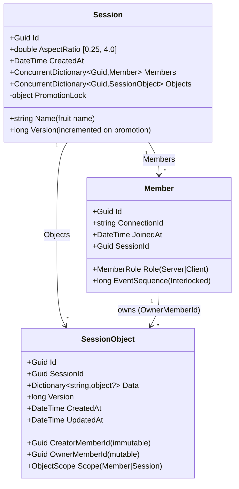

## Service Layer

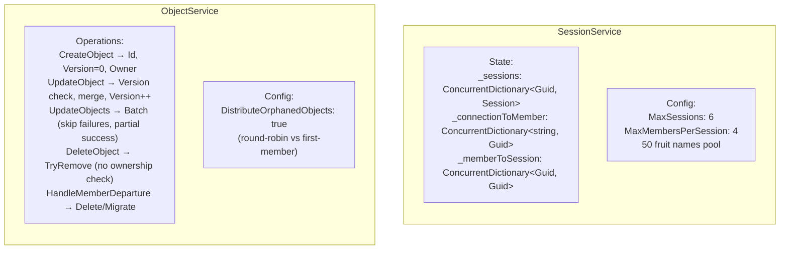

## SessionService: Lookup Chain

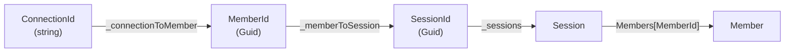

## SessionService: Create & Join

```mermaid
flowchart TB
    subgraph "CreateSession(aspectRatio)"
        CS1{"Connection already<br/>in a session?"}
        CS2{"Active sessions<br/>>= maxSessions (6)?"}
        CS3["Clamp aspectRatio to [0.25, 4.0]"]
        CS4["Pick fruit name:<br/>Random unused from 50-item pool<br/>If all used → append counter (Apple2)"]
        CS5["Create Session with Name, AspectRatio"]
        CS6["Create Member with Role=Server"]
        CS7["Add to _sessions, _connectionToMember,<br/>_memberToSession, session.Members"]
        CS8["Return CreateSessionResult<br/>{Success, Session, Creator}"]
        CSE["Return error"]

        CS1 -->|Yes| CSE
        CS1 -->|No| CS2
        CS2 -->|Yes| CSE
        CS2 -->|No| CS3 --> CS4 --> CS5 --> CS6 --> CS7 --> CS8
    end

    subgraph "JoinSession(sessionId)"
        JS1{"Connection already<br/>in a session?"}
        JS2{"Session exists?"}
        JS3{"Members.Count<br/>>= maxMembers (4)?"}
        JS4["Create Member with Role=Client"]
        JS5["Add to all dictionaries"]
        JS6["Return JoinSessionResult<br/>{Success, Session, Member}"]
        JSE["Return error"]

        JS1 -->|Yes| JSE
        JS1 -->|No| JS2
        JS2 -->|No| JSE
        JS2 -->|Yes| JS3
        JS3 -->|Yes| JSE
        JS3 -->|No| JS4 --> JS5 --> JS6
    end
```

## SessionService: Leave & Server Promotion

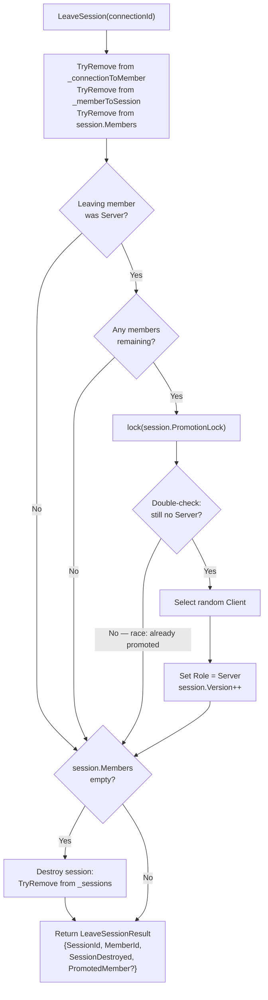

## ObjectService: Optimistic Concurrency

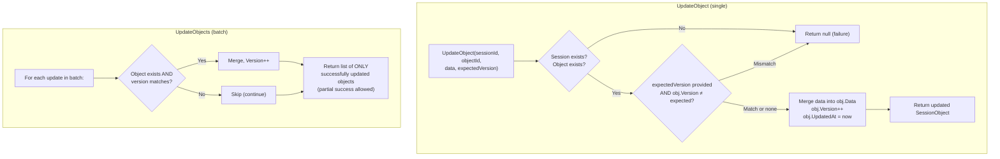

## ObjectService: Member Departure & Ownership Redistribution

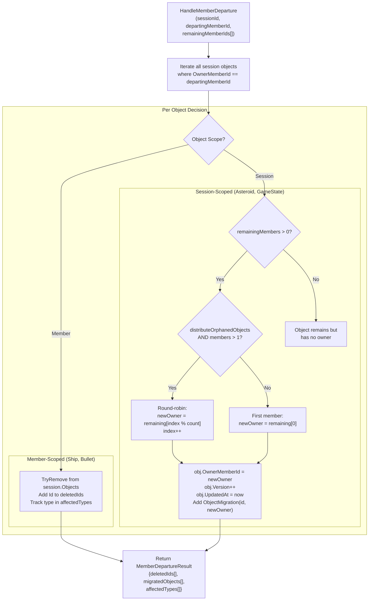

### Round-Robin Example (3 players, Player B leaves)

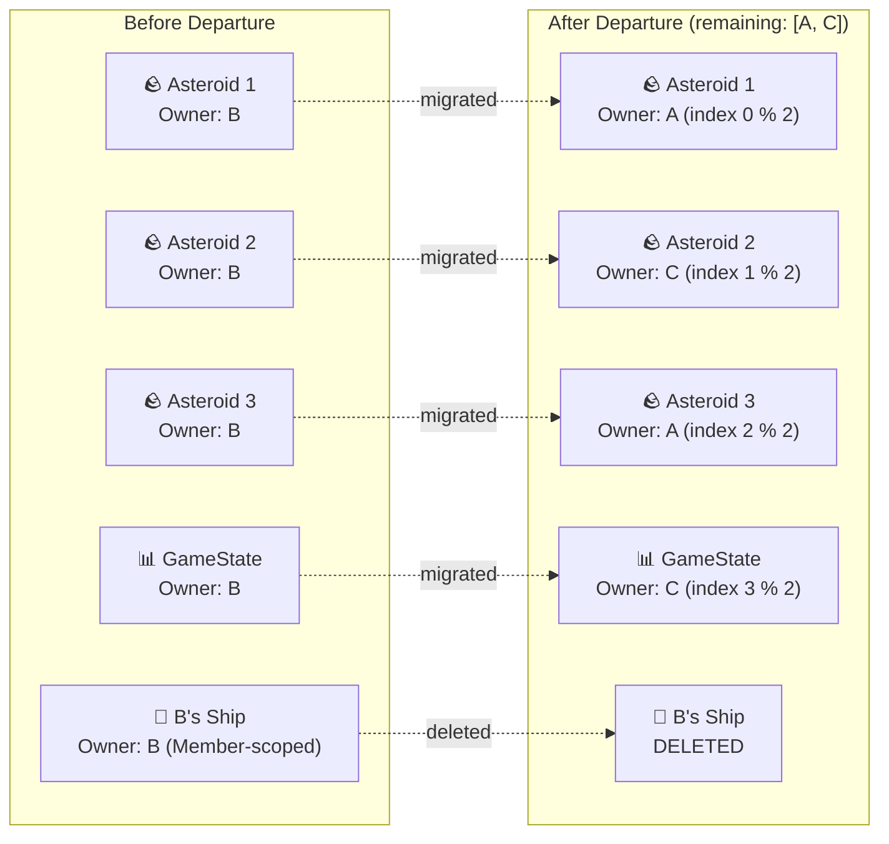

## SessionHub: Method Signatures & Broadcast Patterns

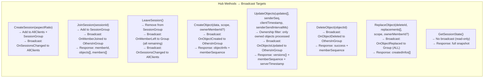

## SessionHub: UpdateObjects Detail

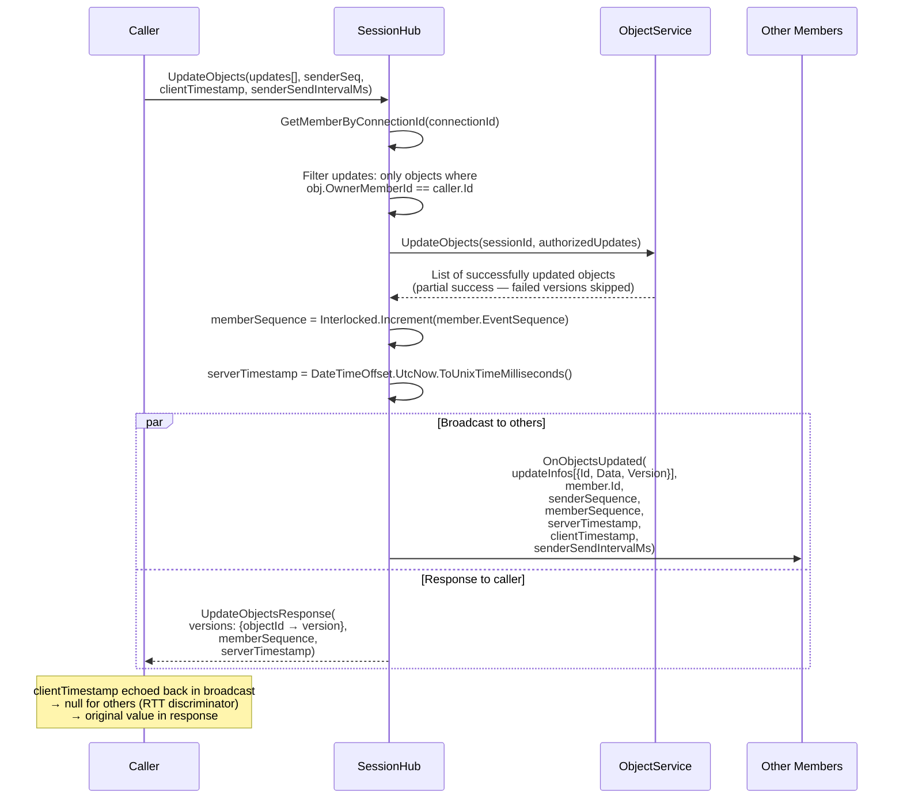

## SessionHub: Leave & Disconnect Flow

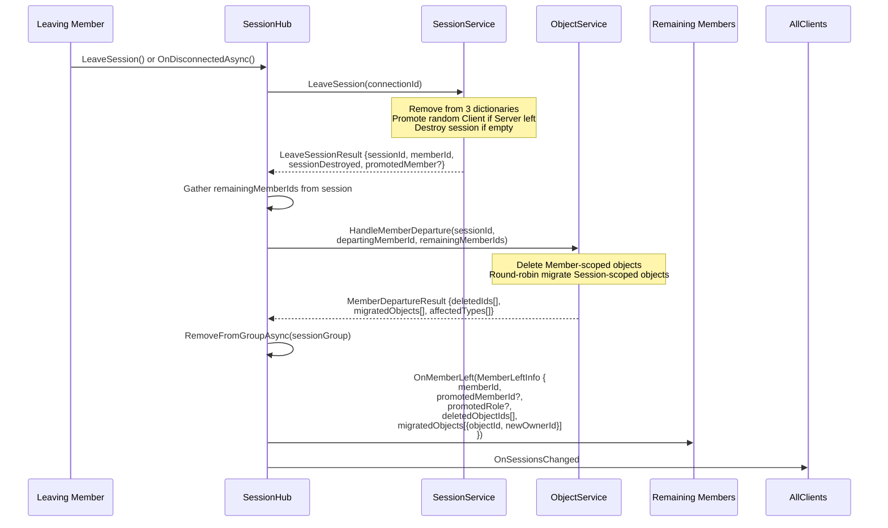

## SignalR Group Management

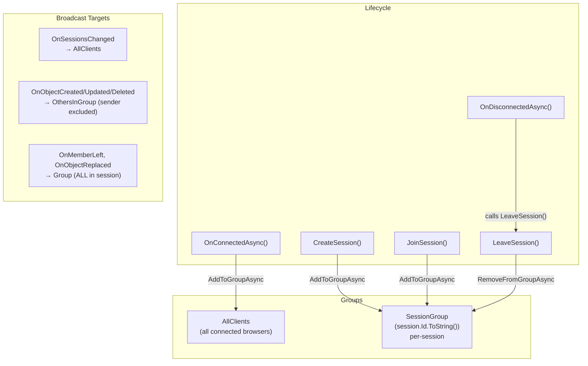

## SessionHub: ReplaceObject (Atomic Delete + Create)

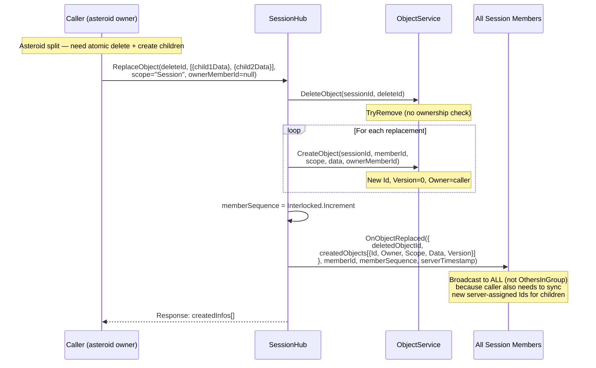

## Session & Member Model

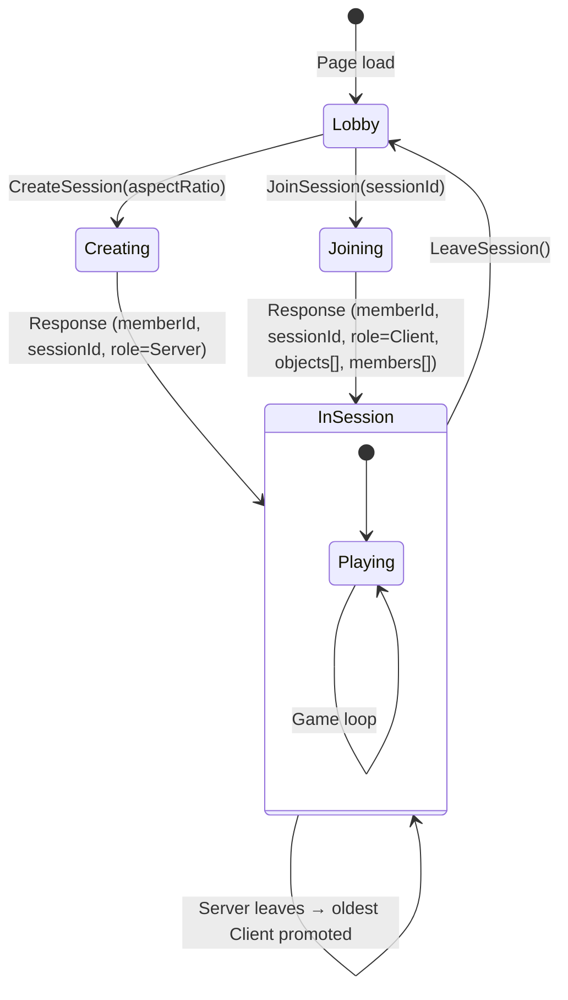

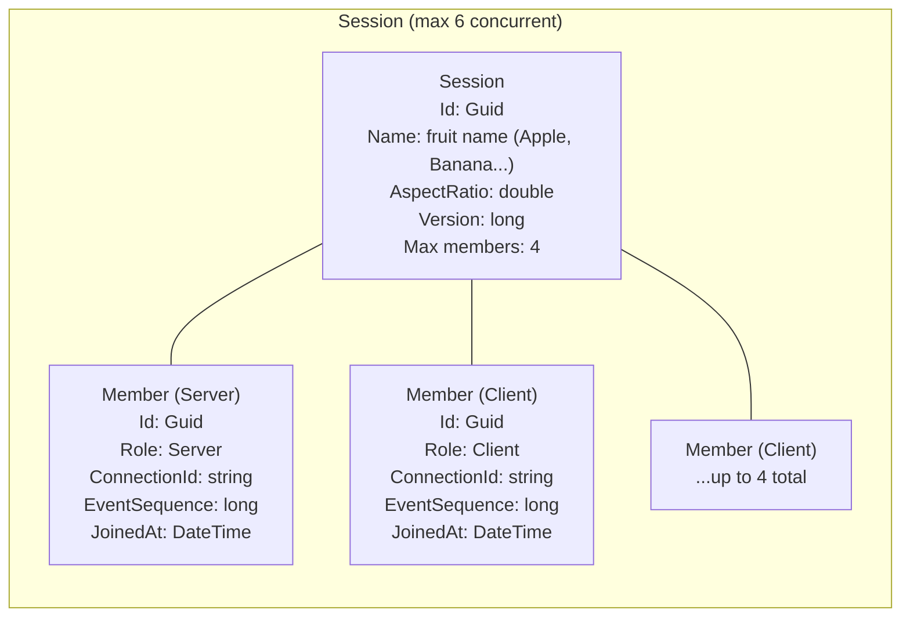

## Object Model & Ownership

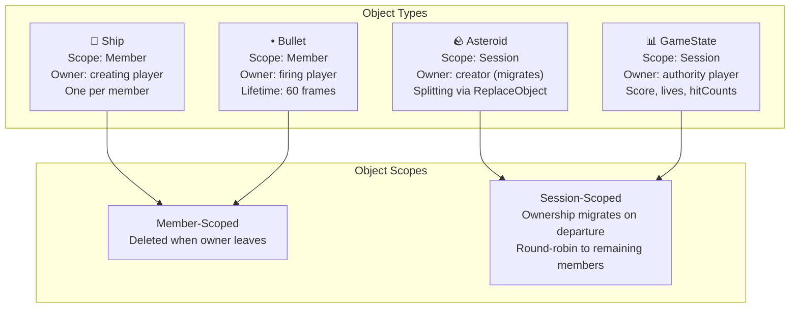

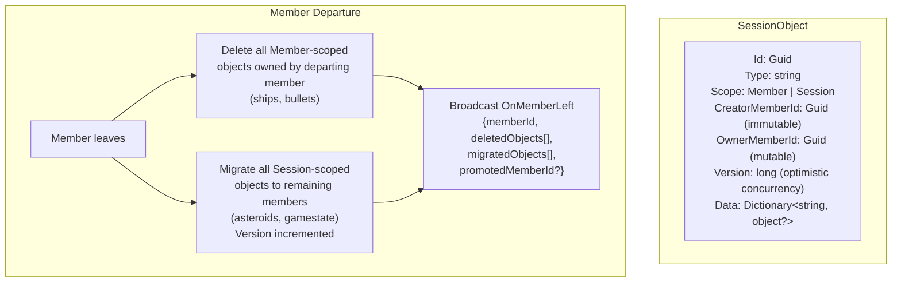

## Async Send/Receive & Sequencing

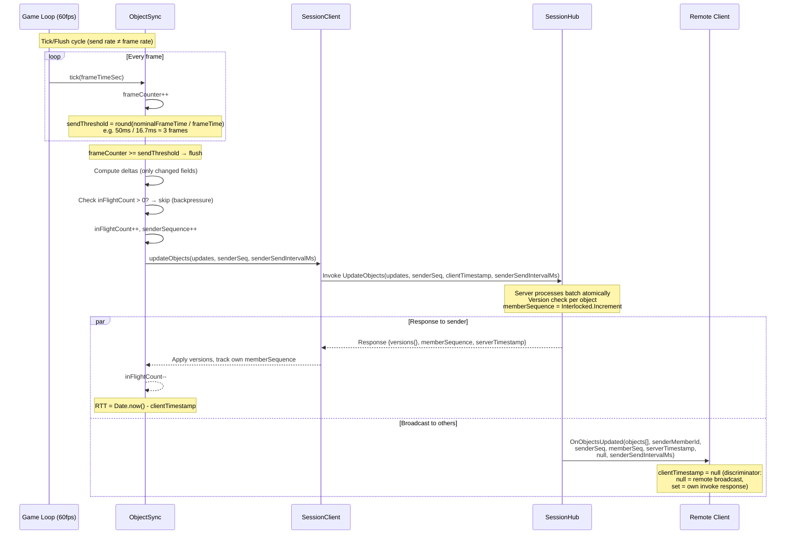

## Sequence Gap Detection & Reconciliation

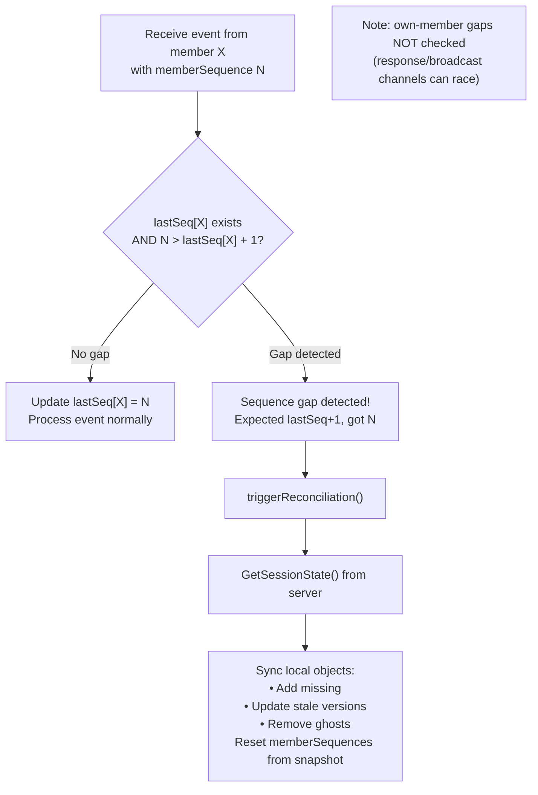

## Networking: RTT → TX → BUF Pipeline

```mermaid
flowchart LR
    subgraph "RTT Estimation"
        SAMPLE["RTT sample =<br/>Date.now() - clientTimestamp"]
        EMA["Asymmetric EMA:<br/>spike: α=0.6 (fast up)<br/>decay: α=0.1 (slow down)<br/>rtt += α × (sample - rtt)"]
        SAMPLE --> EMA
    end

    subgraph "TX (Send Rate)"
        FORMULA["nominalFrameTime =<br/>clamp(rtt/1000,<br/>1/20, 1/1)"]
        TABLE["RTT 4ms → TX 50ms (20Hz)<br/>RTT 100ms → TX 100ms (10Hz)<br/>RTT 500ms → TX 500ms (2Hz)<br/>RTT 1500ms → TX 1000ms (1Hz)"]
        FORMULA --- TABLE
    end

    subgraph "Backpressure"
        BP["inFlightCount > 0?<br/>→ skip this flush<br/>(instant congestion signal)"]
    end

    EMA --> FORMULA
    EMA --> BP
```

```mermaid
flowchart TB
    subgraph "Per-Member BUF Calculation"
        direction TB
        PKT["Packet arrives from member X<br/>(remote broadcast only: clientTimestamp=null)"]
        MEM["getMemberDelay(senderMemberId)<br/>Independent state per member"]
        INT["interval = serverTimestamp - lastServerTimestamp"]
        OUT{"interval > 2 × remoteSendInterval?"}
        SKIP["Outlier: skip interval<br/>(idle gap / delta suppression)"]
        REC["Record interval in packetIntervals[]<br/>(sliding window, 30 samples)"]

        PKT --> MEM
        MEM --> INT
        INT --> OUT
        OUT -->|Yes| SKIP
        OUT -->|No| REC
    end

    subgraph "BUF Formula"
        direction TB
        CALC["observedMean = mean(packetIntervals)<br/>σ = stddev(packetIntervals)<br/>mean = remoteSendInterval ∥ observedMean<br/><br/>networkFactor = min(1.0,<br/>  0.25 + RTT / (2 × mean))<br/><br/>rawDelay = max(16.67ms,<br/>  mean × networkFactor + 2σ)<br/><br/>computedDelay += 0.1 × (rawDelay - computedDelay)"]
    end

    subgraph "Example (localhost)"
        EX["RTT=4ms, TX=50ms, σ=1.7ms<br/>nf = 0.25 + 4/(2×50) = 0.29<br/>raw = 50×0.29 + 2×1.7 = 17.9ms<br/>BUF converges to ~18ms"]
    end

    REC --> CALC
    CALC --> EX
```

## Ring Buffer Interpolation

```mermaid
flowchart TB
    subgraph "Per-Object Ring Buffer (max 6 snapshots)"
        S1["snapshot[0]<br/>data, time, velocity, rotationSpeed"]
        S2["snapshot[1]"]
        S3["snapshot[2]"]
        S4["snapshot[3]"]
        S5["..."]
        S6["snapshot[5]<br/>(newest)"]
        S1 --- S2 --- S3 --- S4 --- S5 --- S6
    end

    TARGET["targetTime = renderTime - getDelayForMember(ownerMemberId)"]

    subgraph "Bracket Search (reverse scan)"
        direction TB
        BEFORE{"targetTime ≤ oldest?"}
        CLAMP["Return oldest snapshot (clamped)"]
        BRACKET{"Find i where<br/>snap[i].time ≤ targetTime < snap[i+1].time"}
        HERMITE["Build pseudo-state from snap[i] & snap[i+1]<br/>Hermite interpolate with t ∈ (0,1]"]
        AFTER{"targetTime ≥ newest?"}
        EXTRAP["Extrapolate with velocity<br/>capped at MAX_EXTRAPOLATION (1.0s)"]
    end

    TARGET --> BEFORE
    BEFORE -->|Yes| CLAMP
    BEFORE -->|No| AFTER
    AFTER -->|Yes| EXTRAP
    AFTER -->|No| BRACKET
    BRACKET --> HERMITE
```

```mermaid
flowchart LR
    subgraph "Hermite Interpolation"
        BASIS["Basis functions:<br/>h00 = 2t³ - 3t² + 1<br/>h10 = t³ - 2t² + t<br/>h01 = -2t³ + 3t²<br/>h11 = t³ - t²"]
        POS["Position (x,y):<br/>p = h00·p₀ + h10·m₀ + h01·p₁ + h11·m₁<br/><br/>Tangents m = velocity × velScale × dt<br/>velScale = refDim / gameWidth<br/>Wrap-aware Δ for p₁ - p₀"]
        ANG["Angle:<br/>Same Hermite with rotationSpeed tangents<br/>rpsToPerSec = TARGET_FPS (60)<br/>Shortest-arc via ±π wrapping"]
        SNAP{"‖p₁ - p₀‖ > SNAP_THRESHOLD (0.25)?"}
        SNAPR["Skip interpolation → snap to p₁"]

        BASIS --> POS
        BASIS --> ANG
        POS --> SNAP
        SNAP -->|Yes| SNAPR
    end
```

## Cross-Owner Collision

```mermaid
sequenceDiagram
    participant A as Player A (bullet owner)
    participant SRV as Server
    participant B as Player B (asteroid owner)

    Note over A: A's bullet hits B's asteroid locally
    A->>A: Mark bullet pendingHit=true, hitTargetId=asteroidId
    A->>SRV: UpdateObjects(bullet with pendingHit)
    SRV->>B: OnObjectsUpdated (bullet data with pendingHit)

    Note over B: B scans remote bullets for pendingHit on own asteroids
    B->>B: Process split: create child asteroids
    B->>SRV: ReplaceObject(asteroidId, [child1, child2])
    SRV->>A: OnObjectReplaced (broadcast to ALL)
    SRV->>B: OnObjectReplaced (broadcast to ALL)

    Note over A: A sees asteroid replaced → confirms hit, awards points
```
