# Astervoids Architecture

## System Overview

## Session & Member Model

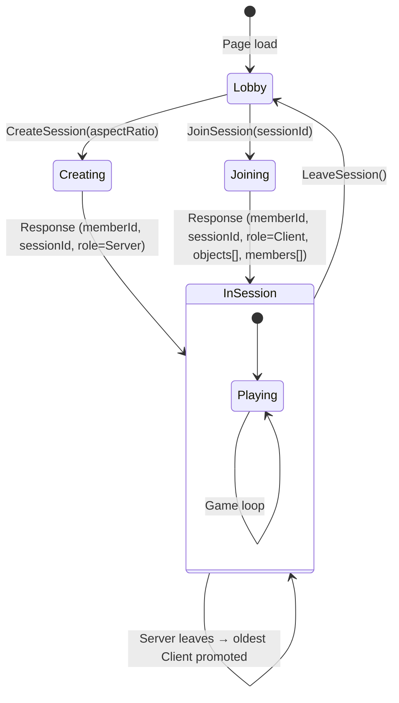

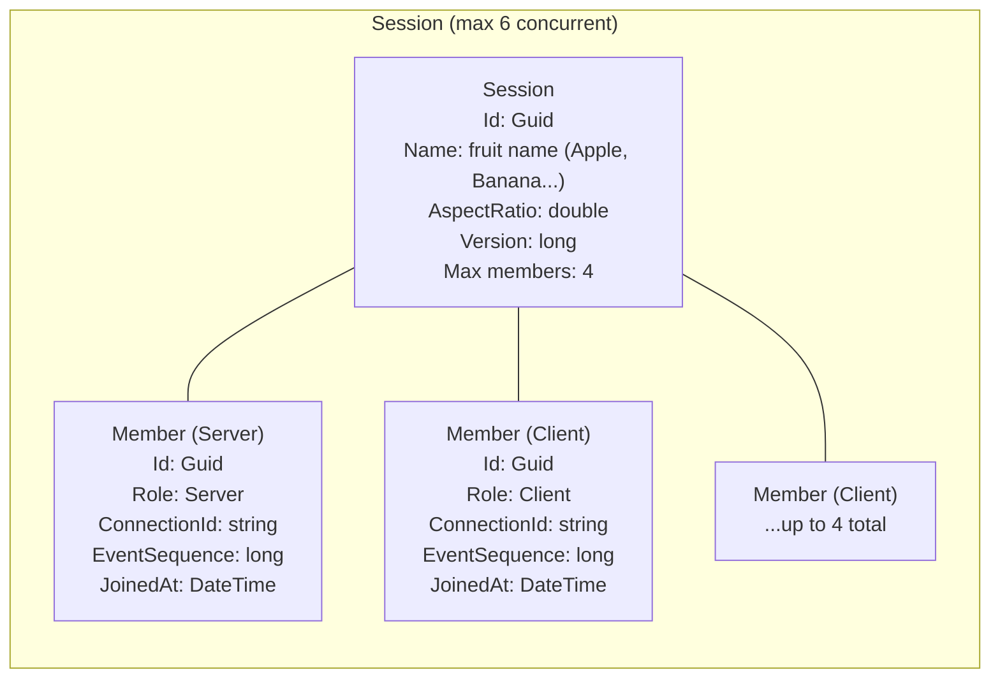

## Object Model & Ownership

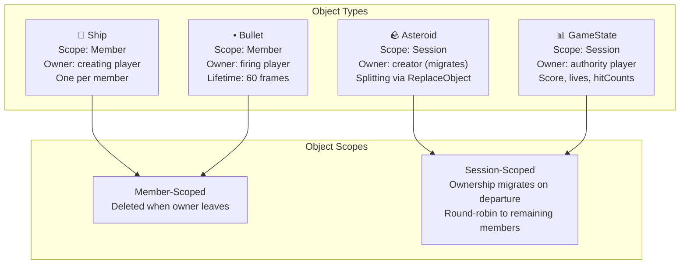

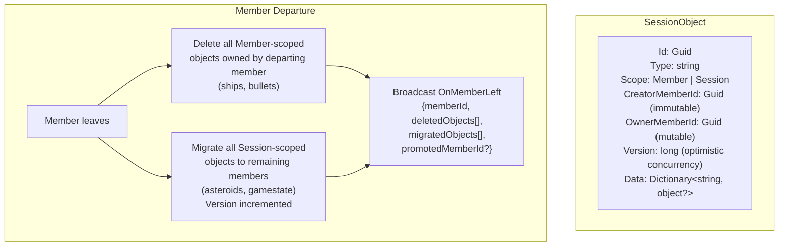

## Async Send/Receive & Sequencing

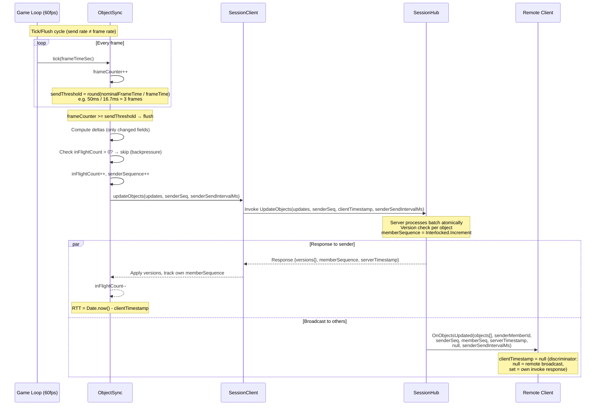

## Sequence Gap Detection & Reconciliation

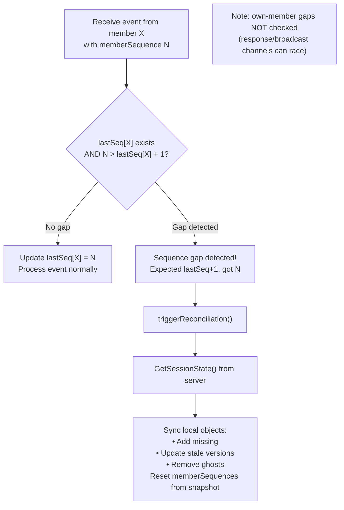

## Networking: RTT → TX → BUF Pipeline

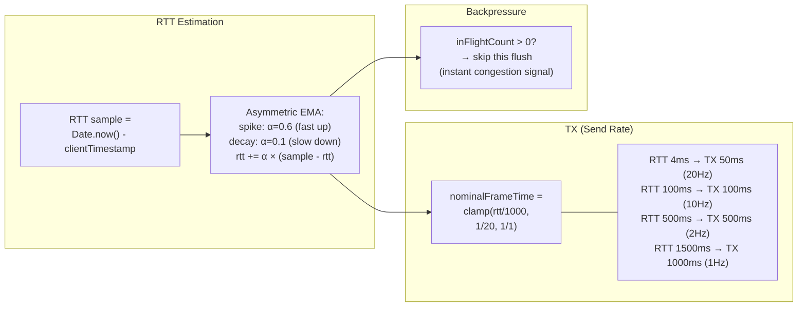

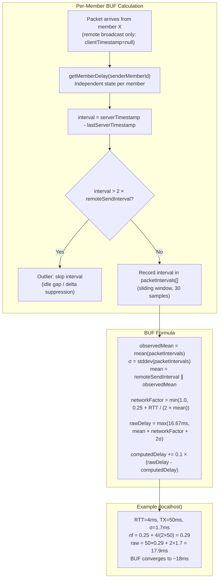

## Ring Buffer Interpolation

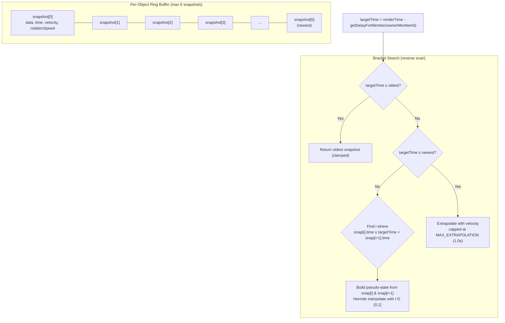

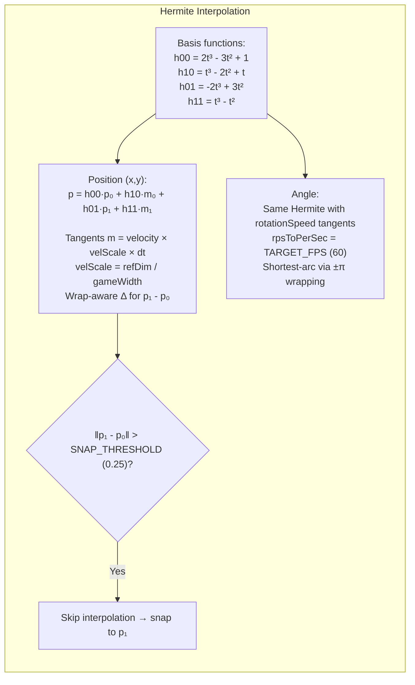

## Cross-Owner Collision

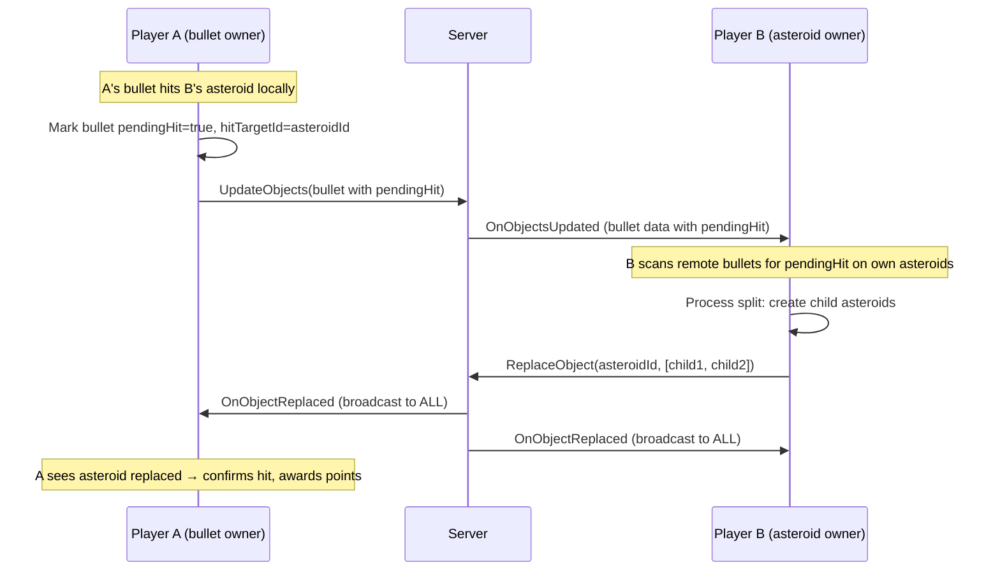
